# Comprehensive Machine Learning Full Pipeline on Heart Disease UCI Dataset

This project aims to **analyze, predict, and visualize heart disease risks** using machine learning. The workflow involves **data preprocessing, feature selection, dimensionality reduction (PCA), model training, evaluation, and deployment**. Classification models like **Logistic Regression, Decision Trees, Random Forest, and SVM** will be used, alongside **K-Means and Hierarchical Clustering** for unsupervised learning. Additionally, a Streamlit UI will be built for user interaction.

## Dataset: [UCL Heart Disease](https://archive.ics.uci.edu/dataset/45/heart+disease)

| Parameter Name         | Feature Code | Description & Clinical Scale                                                  | Used in Model? |
| :--------------------- | :----------- | :---------------------------------------------------------------------------- | :------------- |
| Age                    | age          | Age of patient in years (1–120)                                               | ❌             |
| Sex                    | sex          | Biological sex (1 = Male; 0 = Female)                                         | Yes (Pos 8)    |
| Chest Pain Type        | cp           | 0: Typical Angina \| 1: Atypical Angina \| 2: Non-anginal \| 3: Asymptomatic  | Yes (Pos 3)    |
| Resting Blood Pressure | trestbps     | Resting BP on admission in mm Hg (80–220)                                     | ❌             |
| Serum Cholesterol      | chol         | Serum cholesterol level in mg/dl (100–600)                                    | ❌             |
| Fasting Blood Sugar    | fbs          | Fasting blood sugar > 120 mg/dl (1 = True; 0 = False)                         | ❌             |
| Resting ECG            | restecg      | 0: Normal \| 1: ST-T wave abnormality \| 2: LV Hypertrophy                    | ❌             |
| Max Heart Rate         | thalach      | Maximum heart rate achieved during stress test (60–220)                       | Yes (Pos 5)    |
| Exercise Angina        | exang        | Exercise-induced angina (1 = Yes; 0 = No)                                     | Yes (Pos 7)    |
| ST Depression          | oldpeak      | ST depression induced by exercise relative to rest (0.0–10.0)                 | Yes (Pos 4)    |
| ST Slope               | slope        | Slope of peak exercise ST segment (1: Upsloping \| 2: Flat \| 3: Downsloping) | Yes (Pos 6)    |
| Major Vessels          | ca           | Number of major vessels (0–3) colored by fluoroscopy                          | Yes (Pos 2)    |
| Thalassemia            | thal         | Nuclear stress result (3: Normal \| 6: Fixed Defect \| 7: Reversible Defect)  | Yes (Pos 1)    |

## Analysis

### Data Preprocessing & Cleaning

- Load the Heart Disease UCI dataset `./data/processed.cleveland.data` into a Pandas DataFrame.
- Handle missing values with removing rows with missing values.
- Performing data encoding (one-hot encoding for categorical variables) while standardizing numerical features using StandardScaler resulting scaled data to `20` features instead of `13`

#### EDA

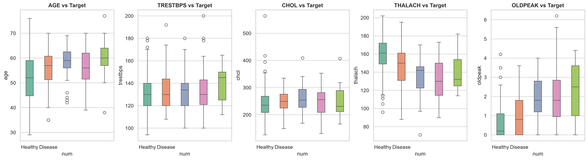
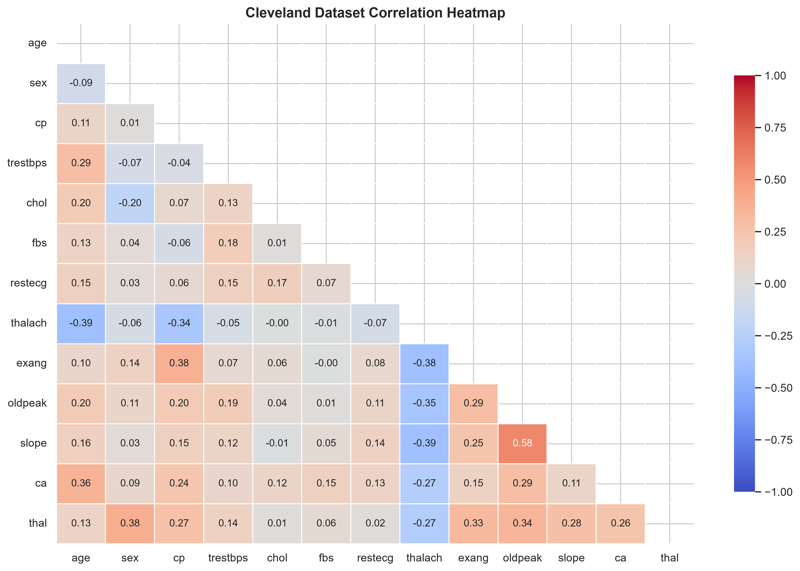
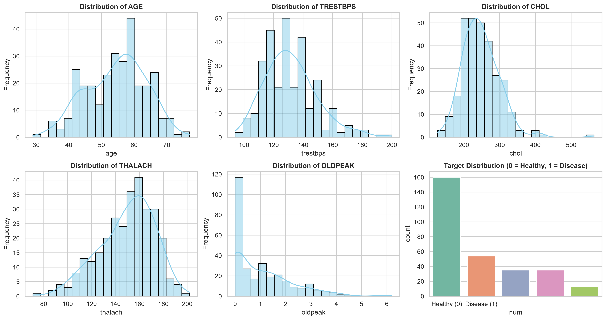

### Dimensionality Reduction - PCA (Principal Component Analysis)

- Apply PCA with variance threshold of 0.95 resulting 13 components needed.

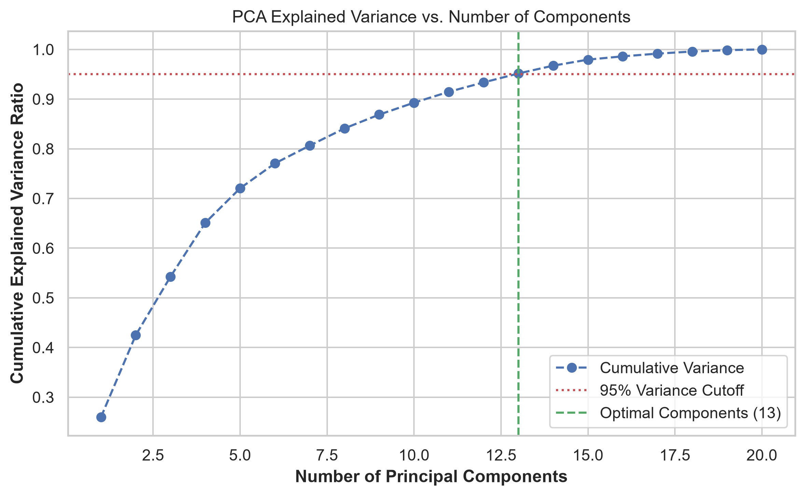
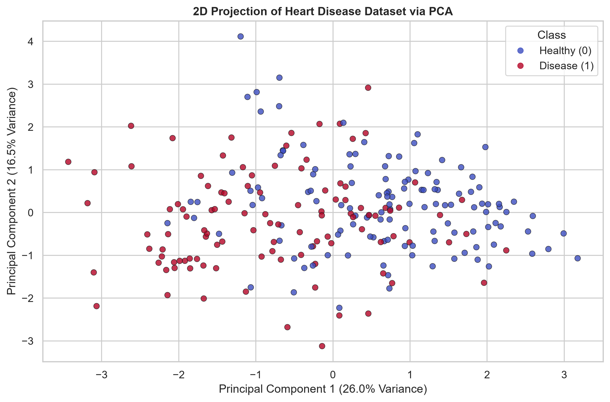

### Feature Selection

- Ranking variables with Random Forest Feature Importance then select the best predictors using Recursive Feature Elimination (RFE) and checking feature significance using Chi-Square Test.
- Resulting the top 8 features:
  `[thal, ca, cp, oldpeak, thalach, slope, exang, sex]`

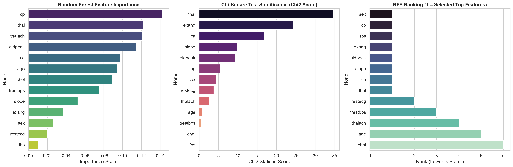

### Supervised Learning - Classification Models

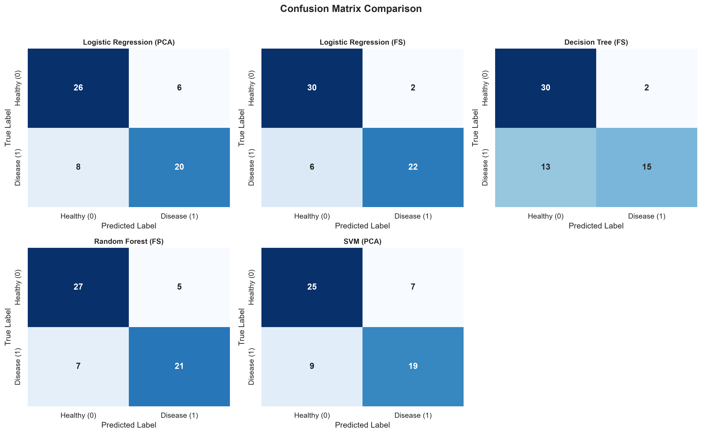
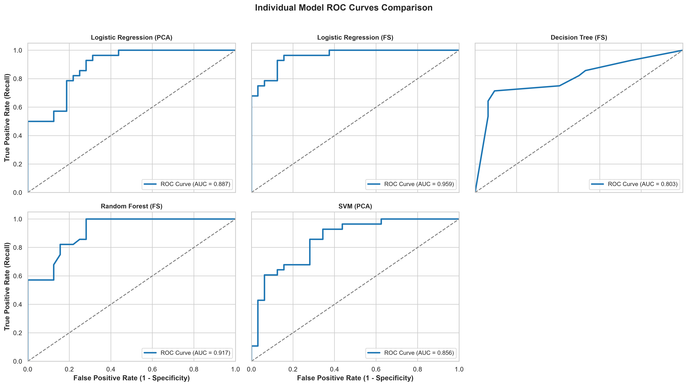

### Unsupervised Learning - Clustering

#### KMean

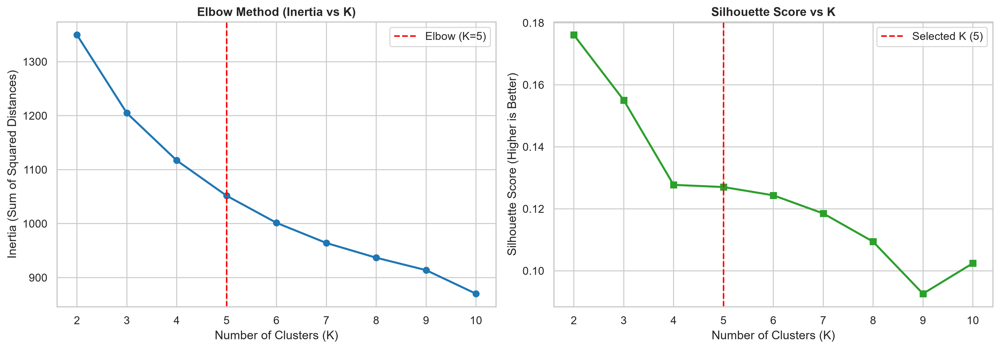

#### Hierarchical Clustering

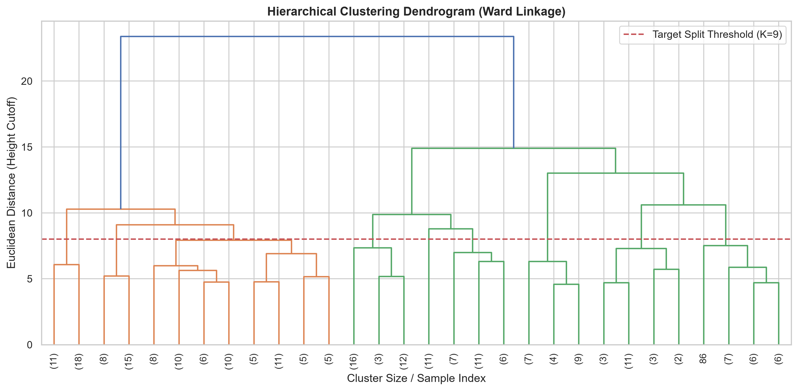

#### Cluster vs Ground Truth

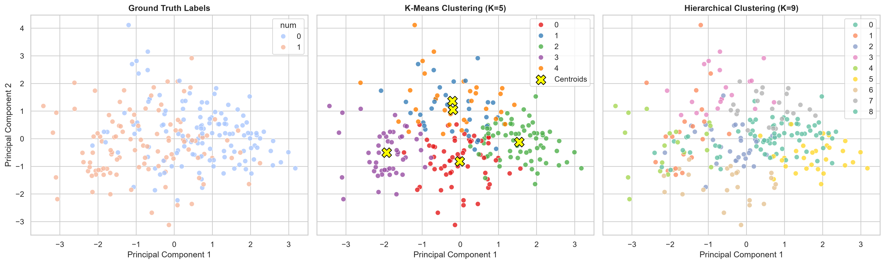

### Hyperparameter Tuning

#### Performance Comparison Table

| Model Variant             | Data Type | Search Method      | Baseline F1 | Tuned Test F1 | F1 Gain | Test ROC-AUC | Test Accuracy |
| ------------------------- | --------- | ------------------ | ----------- | ------------- | ------- | ------------ | ------------- |
| Logistic Regression (FS)  | FS        | GridSearchCV       | 0.8462      | 0.8519        | 0.0057  | 0.9542       | 0.8667        |
| Logistic Regression (PCA) | PCA       | GridSearchCV       | 0.7636      | 0.7407        | -0.0229 | 0.8850       | 0.7667        |
| Decision Tree (FS)        | FS        | GridSearchCV       | 0.6538      | 0.8077        | 0.1538  | 0.8594       | 0.8333        |
| Random Forest (FS)        | FS        | RandomizedSearchCV | 0.7857      | 0.7843        | -0.0014 | 0.9408       | 0.8167        |
| SVM (PCA)                 | PCA       | RandomizedSearchCV | 0.7368      | 0.7170        | -0.0199 | 0.8806       | 0.7500        |

#### Best Performance Model

- Top Performing Model: **Logistic Regression (FS)**
- Dataset Type: Feature selected reduced data
- Selection Metric (Test F1): 0.8519
- Test ROC-AUC Score: 0.9542
- Improvement Over Baseline: +0.0057 F1 Points
- Optimal Hyperparameters:
  - `C: 0.1`
  - penalty: `l2`
  - solver: `lbfgs`

### Model Export & Deployment

- Save the final model using `joblib` to `./models/final_model.pkl`

#### Final Model Evaluation

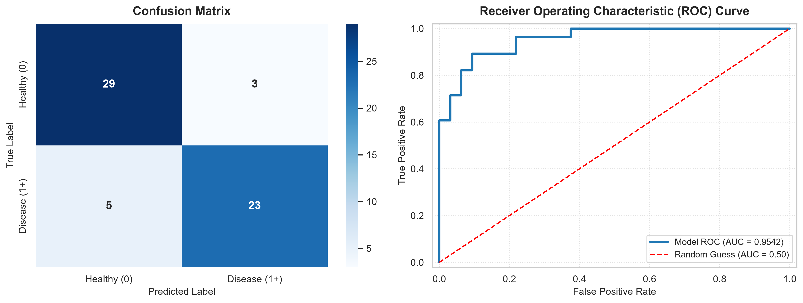

## System Architecture & Workflow

```bash
[ Raw Patient Inputs (13 Clinical Parameters) ]
                       │
                       ▼
[ Feature Filtering & Reordering Engine ] ──► (Filters to 8 Selected Features)
                       │
                       ▼
   [ Trained Model (best_model.pkl) ]
                       │
         ┌─────────────┴─────────────┐
         ▼                           ▼
[ Class 0 (Healthy) / Class 1+ ]  [ Probability Score (%) ]
         │                           │
         └─────────────┬─────────────┘
                       ▼
     [ Streamlit UI + Plotly Visuals ]
```

The system operates across three core functional pipelines:

1. **Clinical Inference Pipeline `(./ui/app.py)`:** Captures complete patient health records via interactive UI controls, isolates the 8 target features in exact model order, and generates confidence-scaled predictions.

2. **Exploratory Data Analysis Pipeline (`./ui/app.py` - Tab 2):** Connects to the underlying historical dataset to provide interactive, multi-dimensional Plotly charts (histograms, box plots, scatter plots, stacked bars).

3. **Model Validation & Reporting Engine (`./libs/evaluate_model.py`):** Programmatically computes diagnostic performance metrics, saves formatted text reports (`./results/evaluation_metrics.txt`), and exports high-resolution evaluation figures (`./output/final_model/final_model_roc_curve_cm_evaluation_graphs.png`).

## Screenshots

### Real-Time Clinical Assessment tap

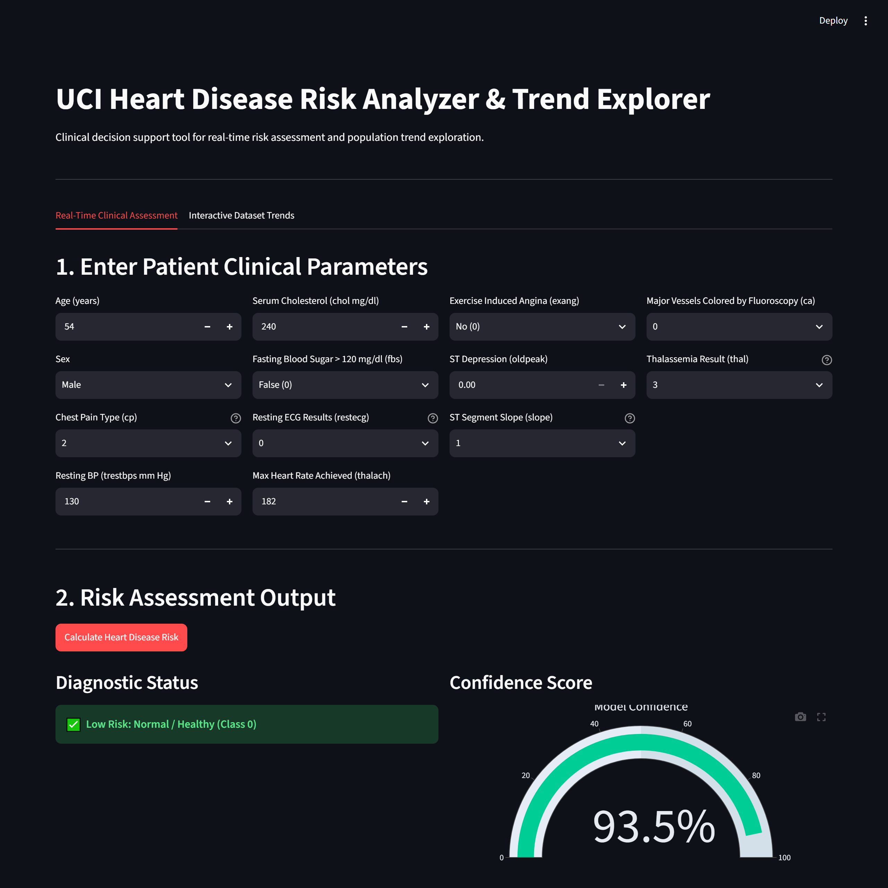
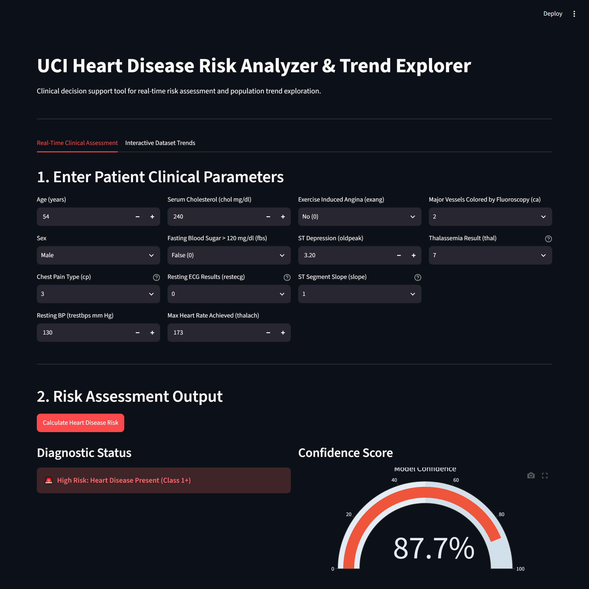

### Interactive Dataset Trends tap

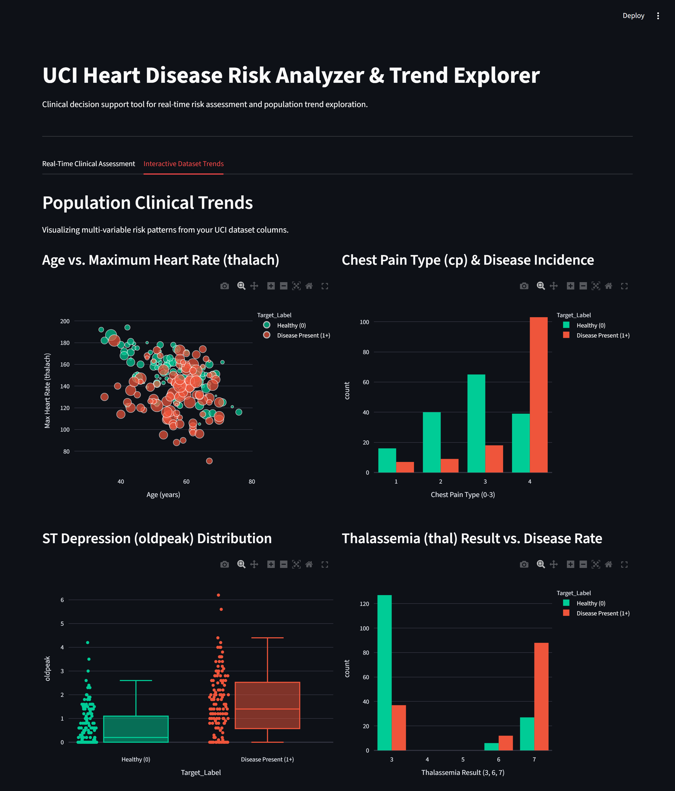

## 📁 File Architecture

```bash
├── config/
│   ├── paths.py
│   └── analysis_settings.py
├── data/
│   └── processed.cleveland.data
├── analysis/
│   ├── analysis.py
│   ├── data_preprocessing.py
│   ├── pca_analysis.py
│   ├── feature_selection.py
│   ├── supervised_learning.py
│   ├── unsupervised_learning.py
│   └── hyperparameter_tuning.py
├── libs/
│   ├── utils.py                # Contains eda function to save EDA graphs
│   ├── evaluate_and_compare_models.py # Save evaluation graphs ROC curve and cm of supervised learning models in comparison
│   └── evaluate_model.py       # Evaluate the final model and save it as text file and plots
├── models/
│   └── final_model.pkl
├── results/
│   └── evaluation_metrics.txt  # Evaluation report of the final model
├── ui/
│   └── app.py                  # Dual-tab Streamlit dashboard
├── screenshots/
├── requirements.txt
├── _test.py                    # Testing the model manually with feature seleced data vector
└── README.md                   # Project overview & quickstart guide
```

## Setup & Execution Guide

### Installation

```bash
# Clone project repository
git clone https://github.com/Mahmoud46/sprints_comprehensive_ml_heart_disease_ucl_dataset.git
cd sprints_comprehensive_ml_heart_disease_ucl_dataset

# Create and activate virtual environment
python -m venv venv
source venv/bin/activate  # On Windows: venv\Scripts\activate

# Install required packages
pip install -r requirements.txt
```

### Running the Web Application

```bash
streamlit run ui/app.py
```

### Running Analysis Script

```bash
python ./analysis/analysis.py
```

---

© July 2025 Mahmoud Zakaria, All rights reserved.
